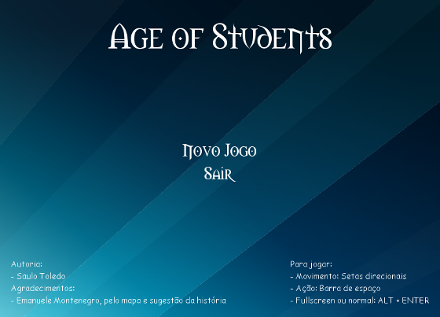
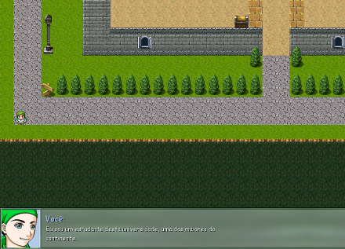
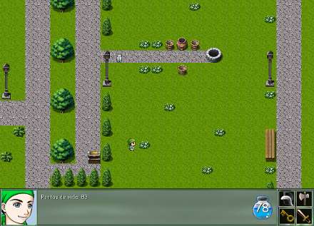
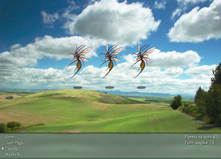

# Age of Students

Age of Students is a 2D turn-based RPG style game developed as a prerequisite to complete the discipline **Programming Lab I**, from the first period of the undergraduate course in Computer Science of the Federal University of Campina Grande in the **second half of the year 2008**, when the author was an undergraduate student. Except for a minor change that allows the game to be played on faster machines ([here](https://github.com/saulotoledo/AgeOfStudents/blob/master/main.py#L25) and [here](https://github.com/saulotoledo/AgeOfStudents/blob/master/main.py#L28)), the game code is provided as delivered in that discipline, no other improvements or fixes were made since then. This repository is intended to be a historical backup of the game. The main game dialogs and texts are written in the [brazilian portuguese](https://en.wikipedia.org/wiki/Brazilian_Portuguese) language.

## Game preview

Check out the [demo on YouTube](https://youtu.be/u4pqEio6UI0)!

## Language, libraries and development

The entire time interval from planning to delivery from this version of the game took about 2 weeks. The challenge was to use [Python](https://www.python.org/) and [PyGame](https://www.pygame.org/) to create a 2D game. The game is compatible with [Python 2.x](https://www.python.org/downloads/release/python-2713/).

## Game requirements

1. Download and install [Python 2.x](https://www.python.org/downloads/) for your operating system;
2. Install [PyGame](https://www.pygame.org/wiki/GettingStarted) by following their website instruction for your operating system. It is possible to use *pip*: `pip install pygame`.

## How to run the game

1. Make sure you meet all the game requirements;
2. Go to the game folder and run `python main.py`;
    * Some systems may have multiple Python versions installed. These systems may require you use the proper Python executable, e.g. `python2.7 main.py`.

## Game controls

### Generic commands
- **ESC key:** Close the game;
- **ALT + ENTER**: Toggle fullscreen mode.

### Intro page
- **Mouse left click on "Sair"**: Close the game;
- **Mouse left click on "Novo Jogo"**: Start the game.

### Game page
- **Arrow keys**: Move the character;
- **Space or Enter keys**: Execute action.

## Copyright information

The game code was developed in a short time interval several years ago and needs improvements, but it is freely available.

The fonts, sounds and most of the images were found available in the internet as free resources and were used here just to acomplish the discipline project. The author of this game disclaims any responsibility for the improper use of any of these resources without the proper permission of their respective authors. **These resources are not included in the code's free licence.** There are images specifically created for this game.

## Special thanks

Special thanks to Emanuele Montenegro for helping me with the map design and with ideas for the game history.
